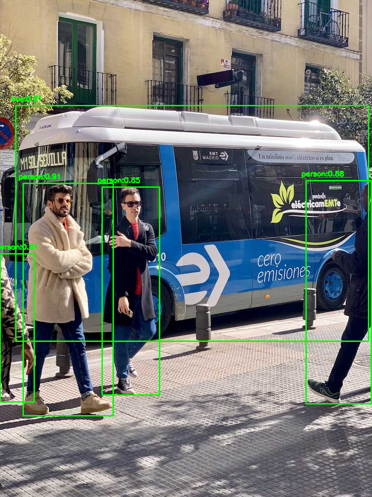
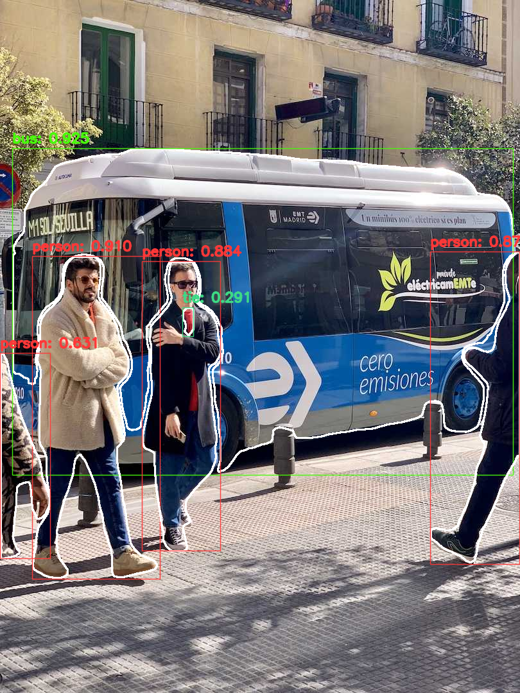

# 1. YOLOv8 NCNN interface
This repository provides a Python demonstration to perform object detection, semantic segmentation, image classification, pose estimation, and oriented bounding box object detection with YOLOv8 using NCNN.

# 2. Installtion
Install the required packages using pip. You will need ultralytics for exporting YOLOv8-xxx NCNN model, ncnn for NCNN model inference, Numpy for data calculation and opencv-python for image processing.

##  Dependencies 
|  Dependency     |  Version       | function |
| :--------       |  :-------      | :------- |
|  OpenCV	      |  >=4.9.0       | read img |
|  Numpy          |  >=1.26.3      | dada process|
|  ncnn           |  1.0.20240102  | ncnn model inferface|
|  yaml           |  >=6.0.1       | load yaml file|


# 3. Getting Started
##  3.1 Exporting YOLOv8 Models
To export YOLOv8 models, you need install ultralytics. ultralytics version 8.1.0.   
use the following Python script:

```python
from ultralytics import YOLO

model_det = YOLO("yolov8s.pt")
model_det.export(format='ncnn')

model_pose = YOLO("yolov8s-pose.pt")
model_pose.export(format='ncnn')

model_cls = YOLO("yolov8s-cls.pt")
model_cls.export(format='ncnn')

model_seg = YOLO("yolov8s-seg.pt")
model_seg.export(format='ncnn')

model_obb = YOLO("yolov8s-obb.pt")
model_obb.export(format='ncnn')
```

Alternatively, you can use the following command in the Command Line Interface (CLI) with a yolo command
```bash
yolo export model=yolov8s.pt format=ncnn
yolo export model=yolov8s-pose.pt format=ncnn
yolo export model=yolov8s-cls.pt format=ncnn
yolo export model=yolov8s-seg.pt format=ncnn
yolo export model=yolov8s-obb.pt format=ncnn
```
After you complete the above operations, you will get five folders:
- yolov8s_ncnn_model
- yolov8s-pose_ncnn_model
- yolov8s-cls_ncnn_model
- yolov8s-seg_ncnn_model
- yolov8s-obb_ncnn_model   

The folders contain the exported ncnn model(model.ncnn.param and model.ncnn.bin), configuration files(metadata.yaml) and python examples(.py).

## 3.2 Download ultralytics datasets config yaml file(option)
yaml address: https://github.com/ultralytics/ultralytics/blob/main/ultralytics/cfg/datasets/
coco.yaml coco-pose.yaml ImageNet.yaml DOTAv1.yaml coco128-seg.yaml

In addition to this, you can also use the yaml file in the above folder.   
Note: update the yaml path in the code    
`CocoYamlPath CocoPoseYamlPath ImageNetYamlPath CocoSegYamlPath  DOTAv1YamlPath`

## 3.3 Run Inference
Perform inference with the exported NCNN model on your images.

` python main.py --model-path <MODEL_PATH> --source <IMAGE_PATH>` 

## 3.4 Example Output
After running the command, you should see segmentation results similar to this:
   

   

   

   

# 4. License
This project is licensed under the AGPL-3.0 License - see the LICENSE file for details.

# 5. Ref
1. The YOLOv8-Segmentation-ONNXRuntime-Python [demo](https://github.com/ultralytics/ultralytics/tree/main/examples/YOLOv8-Segmentation-ONNXRuntime-Python)    
2. [NCNN example](https://github.com/Tencent/ncnn/tree/master/python/examples)   
3. [ultralytics](https://github.com/ultralytics/ultralytics)